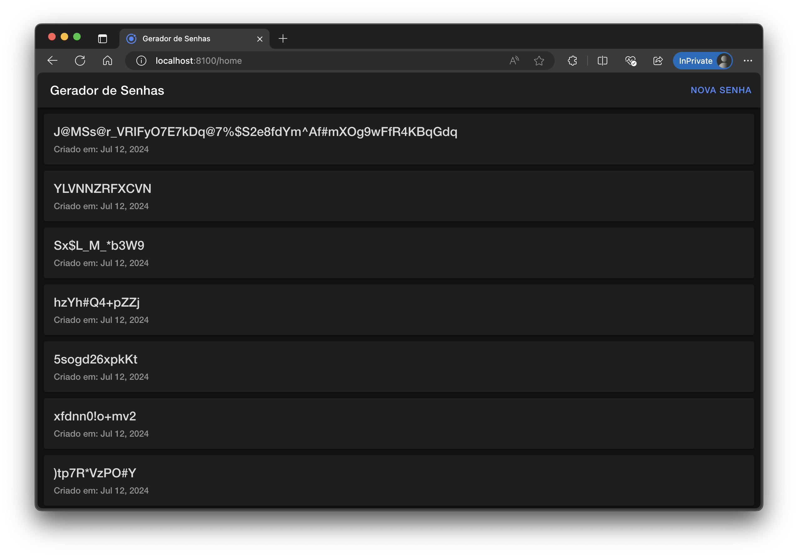
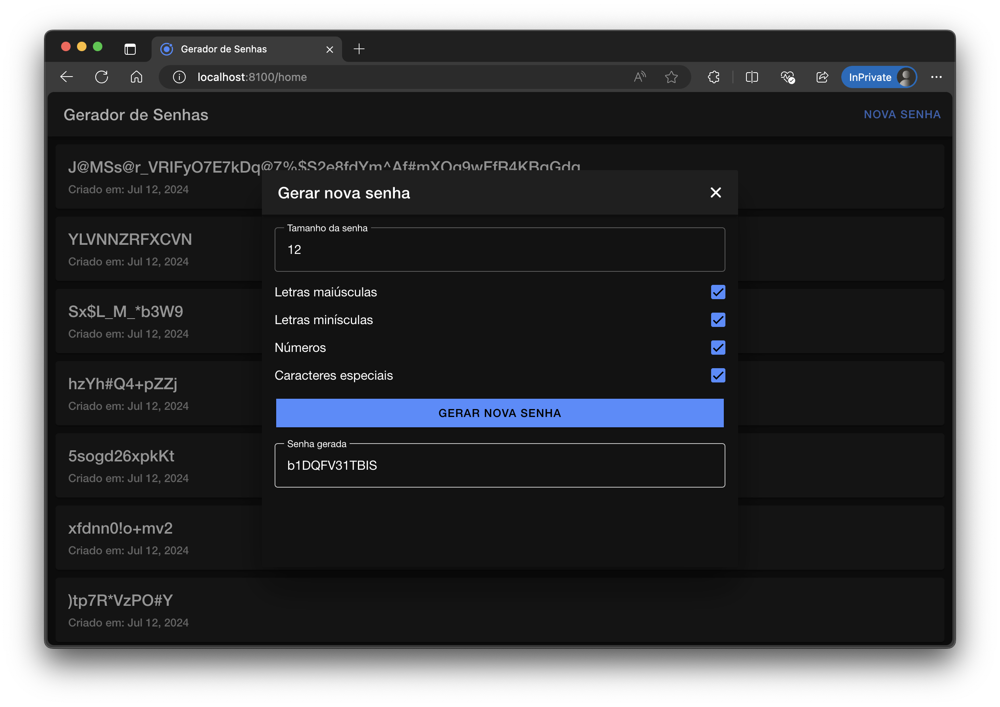

# Aplicativo Gerador de Senhas

Este projeto é um aplicativo Gerador de Senhas construído com Spring Boot para o backend e Ionic Angular para o frontend. O aplicativo permite que os usuários gerem senhas seguras com opções personalizáveis e mantém um histórico de senhas geradas.

## Funcionalidades

- Gerar senhas com comprimento personalizável e tipos de caracteres (maiúsculas, minúsculas, números, caracteres especiais).
- Visualizar o histórico de senhas geradas.
- Validação de formulário para garantir o comprimento da senha e pelo menos um tipo de caractere selecionado.

## Tecnologias Utilizadas

### Backend

- Spring Boot
- Spring Data JPA
- MySQL

### Frontend

- Ionic Framework
- Angular

## Começando

### Pré-requisitos

- Java 17 ou superior
- Node.js e pnpm

### Configuração do Backend

1. Clone o repositório:

   ```sh
   git clone https://github.com/silvercent011/gerador-de-senhas
   cd gerador-de-senhas/backend
   ```

2. Crie um container do MySQL com Docker:

   ```sh
   cd .dev/
   docker-compose up -d
   cd ..
   ```

3. Compile e execute a aplicação Spring Boot:

   ```sh
   ./mvnw spring-boot:run
   ```

   O backend estará rodando em `http://localhost:8080`.

### Configuração do Frontend

1. Navegue até o diretório do frontend:

   ```sh
   cd ../frontend
   ```

2. Instale as dependências:

   ```sh
   npm install
   ```

3. Execute a aplicação Ionic:

   ```sh
   ionic serve
   ```

   O frontend estará rodando em `http://localhost:8100`.

## Endpoints da API

### Gerar Senha

- **URL:** `/api/generate-password`
- **Método:** `POST`
- **Corpo da Requisição:**

  ```json
  {
    "length": 12,
    "useUpper": true,
    "useLower": true,
    "useNumbers": true,
    "useSpecial": true
  }
  ```

- **Resposta:**

  ```json
  {
    "password": "GeneratedPassword123!"
  }
  ```

### Histórico de Senhas

- **URL:** `/api/password-history`
- **Método:** `GET`
- **Resposta:**

  ```json
  [
    {
      "id": 1,
      "password": "GeneratedPassword123!",
      "createdAt": "2024-07-12T12:00:00.000+00:00"
    },
    ...
  ]
  ```

## Validação do Formulário

O formulário do frontend inclui as seguintes validações:

- **Comprimento:** A senha deve ter no mínimo 8 caracteres.
- **Tipos de Caracteres:** Pelo menos uma das caixas de seleção de tipo de caractere (maiúsculas, minúsculas, números, caracteres especiais) deve estar marcada.

### Implementação

#### Backend

O backend é implementado usando Spring Boot com um controlador simples para lidar com as requisições da API. O repositório usa Spring Data JPA para interagir com um banco de dados MySQL.

#### Frontend

O frontend é construído com Ionic e Angular. Ele usa Reactive Forms para lidar com a validação do formulário e HTTPClient para se comunicar com a API do backend. O formulário inclui validação para garantir o comprimento da senha e pelo menos um tipo de caractere selecionado.

## Capturas de Tela

### Página de Histórico de Senhas

A página inicial exibe o histórico de senhas geradas ordenadas por data e hora de geração do mais recente para o mais antigo.



### Página de Gerar Senha

A página de geração de senhas foi implementada em um modal por razões de usabilidade do Ionic. Ao fechar o modal, a página atualiza automaticamente para exibir a senha gerada mais recentemente.



## Contribuindo

1. Faça um fork do repositório.
2. Crie uma nova branch (`git checkout -b feature/sua-feature`).
3. Faça suas alterações.
4. Commite suas alterações (`git commit -m 'Adicionei alguma feature'`).
5. Faça o push para a branch (`git push origin feature/sua-feature`).
6. Abra um pull request.
